# NexSlice: Towards an Open and Reproducible Network Slicing Testbed for 5G and Beyond

<div align="center">
    
</div>

## Citation
This work has been accepted as a demo paper at The 27th International Conference on Modeling, Analysis and Simulation of Wireless and Mobile Systems (MSWiM 2025), Barcelona, Spain, October 27th – 31st, 2025

If you use NexSlice in your research or experiments, please cite our paper once it is published in IEEE (The official DOI and link will be added here upon publication).

## Overview

**NexSlice** is a modular, open-source testbed for 5G core network slicing built natively on Kubernetes. It supports scalable slice instantiation using open-source components such as **OpenAirInterface (OAI)** and **UERANSIM**, and integrates both monolithic and disaggregated RANs.


This repository contains Helm charts and deployment scripts for:
- OAI 5G SA Core
- OAI disaggregated CU/DU RAN with NR-UEs
- UERANSIM simulator for gNBs and UEs
- Monitoring via **Prometheus**, **Grafana**, and **Lens**

Slicing is implemented by mapping UEs to unique **S-NSSAI** identifiers (SST, SD), with dedicated SMF/UPF instances per slice and shared AMF/NSSF/AUSF/UDM/UDR. This setup enables reproducible experiments across isolated, service-tailored network slices (eMBB, URLLC, etc.).

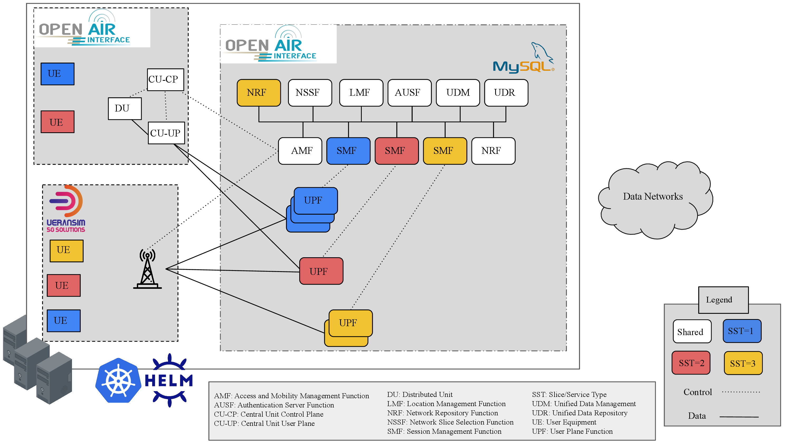

## Table of Contents

- [Build a K3s cluster](#build-a-k3s-cluster)
- [Tools Setup](#tools-setup)
- [OAI 5G SA Core Deployment](#oai-5g-sa-core-deployment)
- [5G RANs Deployments](#ueransim)
- [Monitoring](#monitoring)
- [Tests](#generate-traffic-using-iperf3)
- [Clean the cluster](#clean-the-cluster)


# Build a K3S cluster
K3S is a lightweight, certified Kubernetes distribution designed for production workloads in resource-constrained environments.  
It packages all the essential Kubernetes components into a single binary, reduces memory footprint, and simplifies cluster setup.  
K3S is ideal for edge computing, IoT, labs, or single-node clusters, while remaining fully compatible with standard Kubernetes APIs and tools. You can find more in : https://docs.k3s.io/


## Requirements
- Architecture: **AMD64 (x86_64)**
- A Linux distribution (tested on **Ubuntu 24.04**) running on a physical machine or virtual machine.
- **Sudo privileges**  
- **UFW (Uncomplicated Firewall)** must be disabled on k3s server and agents:
```bash
sudo ufw disable
```

1. **Install K3S on the server:**
```bash
curl -sfL https://get.k3s.io | sh -
```

Configure k3s:

```bash
mkdir -p ~/.kube
sudo cp /etc/rancher/k3s/k3s.yaml ~/.kube/config
sudo chown $(id -u):$(id -g) ~/.kube/config
```


You can create a K3S cluster using just a single server node, or optionally add agent nodes for distributing workloads.


2. **Add agent nodes:** 
**NOTE**: On the agent machines, disable UFW and join the agent to the K3s cluster. All remaining commands from this repository should be executed on the server machine.

```bash
curl -sfL https://get.k3s.io | K3S_URL=https://<SERVER_IP>:6443 K3S_TOKEN=<NODE_TOKEN> sh -
```
- <MASTER_IP>: IP address of the server node using "ip a"
- <NODE_TOKEN>: Retrieve from server with "sudo cat /var/lib/rancher/k3s/server/node-token"

3. **Check all nodes in the cluster:**
```bash
sudo k3s kubectl get nodes
```

**Note**: Several screenshots were taken from the **main** branch of NexSlice, which uses standard kubectl commands. When running NexSlice on **k3s**, make sure to prepend "sudo k3s" to each kubectl command (unless it already works without it on your setup).

# Tools Setup

1.  Install the Helm CLI using this link: https://helm.sh/docs/intro/install/

Helm CLI (Command-Line Interface) is a command-line tool used for managing applications on Kubernetes clusters. It is part of the Helm package manager, which helps you package, deploy, and manage applications as reusable units called Helm charts.

Helm provides a straightforward way to define, install, and upgrade complex Kubernetes applications. With Helm, you can define the desired state of your application using a declarative YAML-based configuration file called a Helm chart. A Helm chart contains all the necessary Kubernetes manifests, configurations, and dependencies required to deploy and run your application.

2.  Install Helm Spray using this command: 
```bash[language=bash]
helm plugin install https://github.com/ThalesGroup/helm-spray
```
Helm Spray is a Helm plugin that simplifies the deployment of Kubernetes applications using Helm charts. Helm is a package manager for Kubernetes that allows you to define, install, and manage applications as reusable units called charts. Helm Spray extends Helm's functionality by providing additional features and capabilities for managing the lifecycle of complex deployments. The command helm plugin install installs the Helm Spray plugin, enabling you to use its functionalities alongside Helm.

3. Clone Multus GitHub repository:
```bash[language=bash]
git clone https://github.com/k8snetworkplumbingwg/multus-cni.git
```
  - Apply a daemonset which installs Multus using kubectl. Apply the daemonset YAML file:
    ```bash[language=bash]
    sudo k3s kubectl apply -f multus-cni/deployments/multus-daemonset-thick.yml
    ```
4. Create nexslice namespace using the below command: 
    ```bash[language=bash]
    sudo k3s kubectl create namespace nexslice
    ```

5. Clone this repository:
```bash[language=bash]
git clone -b k3s https://github.com/AIDY-F2N/NexSlice.git
cd NexSlice/
```

6. Install Metrics Server:
To enable auto-scaling features like HPA (Horizontal Pod Autoscaler), deploy the Kubernetes metrics server:
```bash[language=bash]
sudo k3s kubectl apply -f metricserver.yaml
```


# OAI 5G SA Core Deployment
1. Open a terminal inside the folder "NexSlice" and run the following commands to deploy the 5g core:
```bash[language=bash]
helm dependency update 5g_core/oai-5g-advance/
helm install 5gc 5g_core/oai-5g-advance/ -n nexslice
```
These commands update chart dependencies and deploy the full OAI 5G SA Core into your cluster.

To confirm the deployment status of the core components:
```bash[language=bash]
sudo k3s kubectl get pods -n nexslice 
```

<div align="center">
    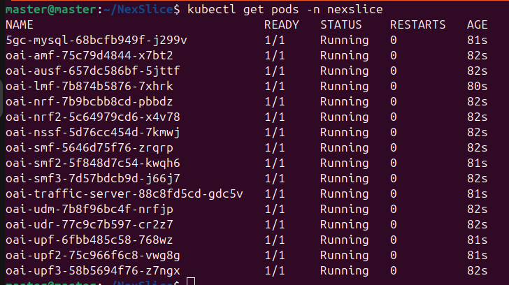
</div>


# Radio Access Networks (RANs)
NexSlice supports the deployment of two types of 5G RANs: the disaggregated OpenAirInterface (OAI) RAN and the simulated UERANSIM RAN. These deployments allow testing slicing capabilities in both realistic and emulated environments.

## OAI Disaggregated 5G RAN
This setup launches the OAI RAN components—CU-CP, CU-UP, and DU—with support for SST-based slicing (e.g., SST 1–3). It also deploys multiple OAI NR-UEs, each assigned to a specific slice. 

Deploy the components ONE AT A TIME, waiting a few seconds between each step to allow proper initialization.

```bash[language=bash]
helm install cucp 5g_ran/dis_ran_gnb1/oai-cu-cp/ -n nexslice
helm install cuup 5g_ran/dis_ran_gnb1/oai-cu-up -n nexslice
helm install du 5g_ran/dis_ran_gnb1/oai-du -n nexslice

helm install nrue1 5g_ran/oai-nr-ue1 -n nexslice 
helm install nrue2 5g_ran/oai-nr-ue2 -n nexslice

sudo k3s kubectl get pods -n nexslice | grep -E 'cu-cp|cu-up|du|nr-ue'
```

You can verify that NR-UEs received an IP address using:

```bash[language=bash]
sudo k3s kubectl exec -it -n nexslice -c nr-ue $(sudo k3s kubectl get pods -n nexslice | grep oai-nr-ue | awk '{print $1}') -- ifconfig oaitun_ue1 |grep -E '(^|\s)inet($|\s)' | awk {'print $2'}
sudo k3s kubectl exec -it -n nexslice -c nr-ue $(sudo k3s kubectl get pods -n nexslice | grep oai-nr-ue2 | awk '{print $1}') -- ifconfig oaitun_ue1 |grep -E '(^|\s)inet($|\s)' | awk {'print $2'}
```
To confirm successful connection to the Internet:

```bash[language=bash]
sudo k3s kubectl exec -it -n nexslice -c nr-ue $(sudo k3s kubectl get pods -n nexslice | grep oai-nr-ue | awk '{print $1}') -- ping -I oaitun_ue1 -c4 google.fr
sudo k3s kubectl exec -it -n nexslice -c nr-ue $(sudo k3s kubectl get pods -n nexslice | grep oai-nr-ue2 | awk '{print $1}') -- ping -I oaitun_ue1 -c4 google.fr
```

<div align="center">
    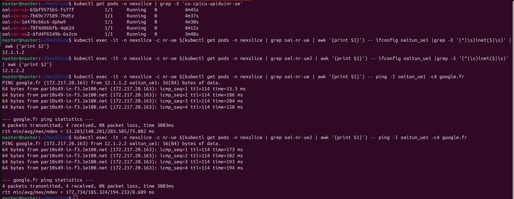
</div>

## UERANSIM Deployment

UERANSIM (User Equipment and RAN Simulator) is an open-source 5G simulator that emulates both the gNB and UE functionalities. It enables testing mobility, session setup, slicing behavior, and QoS in a lightweight environment.

Deploy the components ONE AT A TIME, waiting a few seconds between each step to allow proper initialization.

```bash[language=bash]
helm install ueransim-gnb 5g_ran/ueransim-gnb2/ -n nexslice

helm install ueransim-ue1 5g_ran/ueransim-ue1/ -n nexslice
helm install ueransim-ue2 5g_ran/ueransim-ue2/ -n nexslice
helm install ueransim-ue3 5g_ran/ueransim-ue3/ -n nexslice
```

Check running pods:

```bash[language=bash]
sudo k3s kubectl get pods -n nexslice | grep ueransim
sudo k3s kubectl logs -n nexslice <ueransim-gnb name> 
```
<div align="center">
    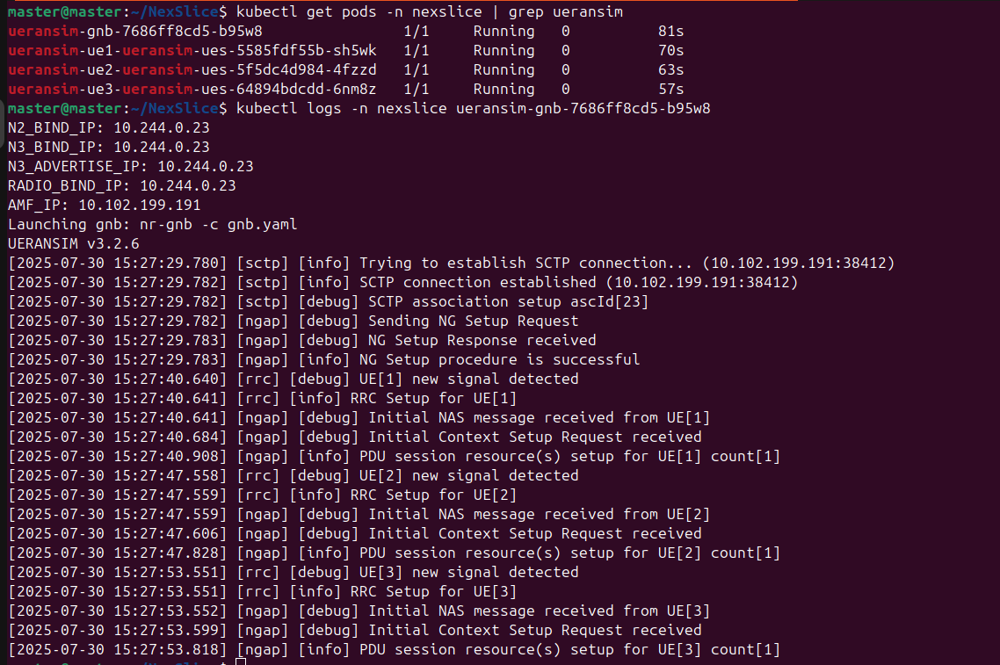
</div>

View logs:

```bash[language=bash]
sudo k3s kubectl logs -n nexslice <ueransim-ue name>
```
<div align="center">
    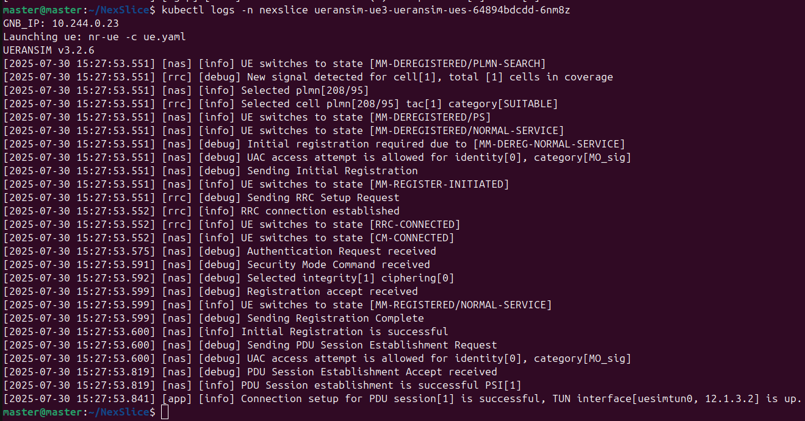
</div>
The same command can be used to test other UEs

Test data session by pinging from a UE:

```bash[language=bash]
sudo k3s kubectl exec -it -n nexslice <ueransim-ue name> -- ping -c 3 -I uesimtun0 google.com
```

<div align="center">
    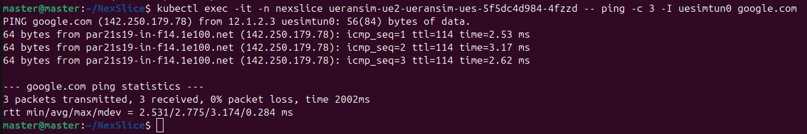
</div>
The same command can be used to test other UEs

## SST-Based Slicing

UEs connect to different slices based on their selected SSTs, each receiving an IP from a distinct subnet linked to a specific DNN.

<div align="center">
    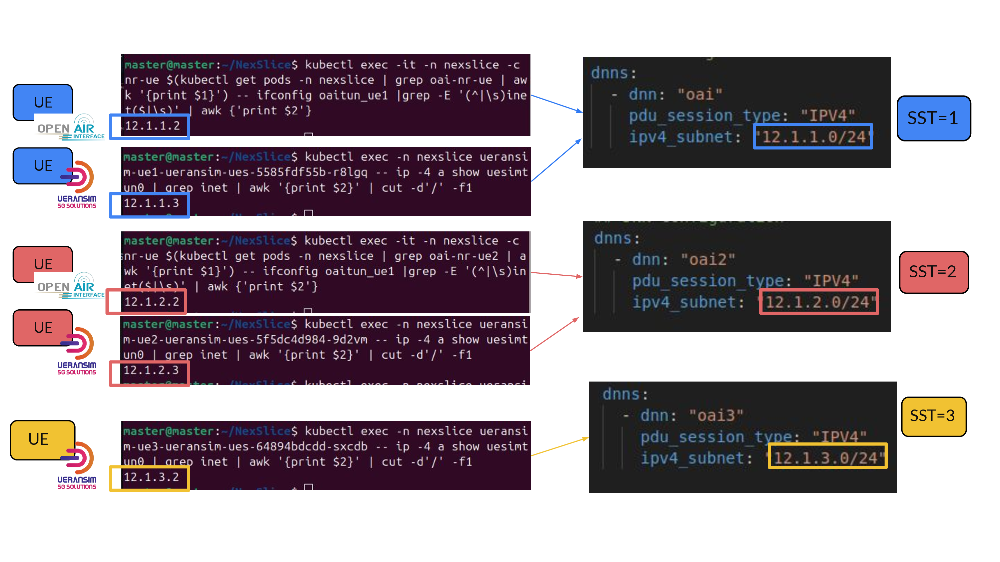
</div>

# Monitoring
To enable observability of the system, NexSlice integrates Prometheus for metrics collection and Grafana for real-time visualization of the cluster, network slices, and VNF behavior.

```bash[language=bash]
sudo k3s kubectl create ns monitoring
helm install monitoring monitoring/ -n monitoring
```

Now you should be able to access the Grafana dashboard. You can use port forwarding using the following command (Replace <grafana-pod-name> by the name of your grafana pod )

```bash[language=bash]
sudo k3s kubectl get pods -n monitoring
sudo k3s kubectl port-forward -n monitoring <grafana-pod-name> 3000 &
```

<div align="center">
    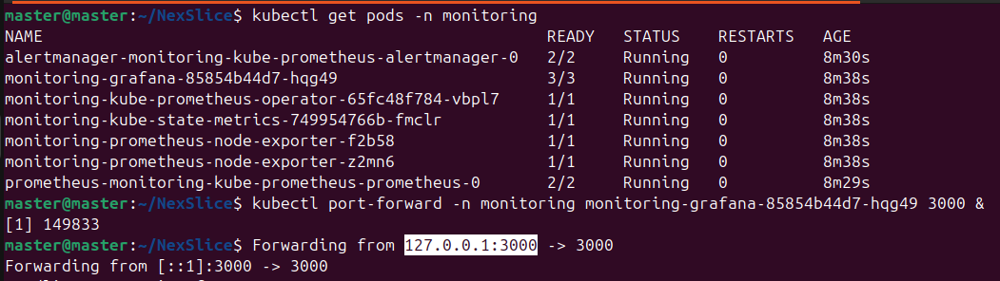
</div>


Make sure the port is allowed in the firewall to be accessed from your workstation.

You will be able to access Grafana from http://localhost:3000
```bash[language=bash]
User: admin
Password: prom-operator
```

<div align="center">
    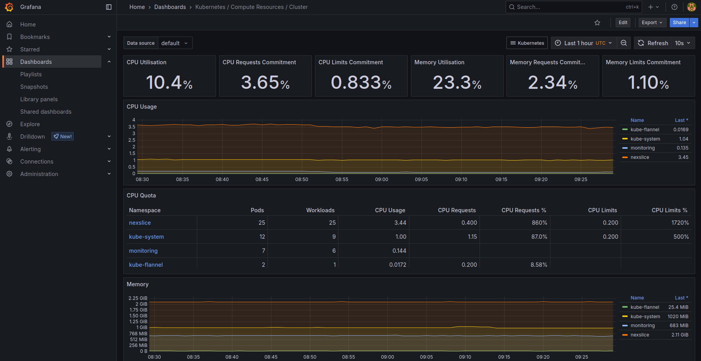
</div>

Go to Dashboards and click on it — you’ll find multiple dashboards covering the entire cluster, nodes, pods, etc. When selecting a dashboard, make sure to choose the correct namespace if applicable (**not default** — use NexSlice instead), and then select the pod whose resources you want to monitor.

## Lens UI
Once your cluster is ready, use Lens — a powerful Kubernetes IDE — to manage your cluster visually instead of using `kubectl` in the CLI.

1. **Download Lens**: [https://k8slens.dev/download](https://k8slens.dev/download)  
2. **Launch the application.**  
3. Lens will automatically detect your kubeconfig file (`~/.kube/config`).  
4. Click **“Add Cluster”** and select your cluster from the list.  
5. You're ready to view **workloads, logs, nodes, CPU/memory usage**, and much more — all in a visual interface.

<div align="center">
    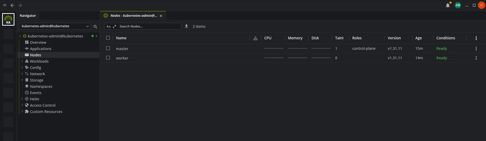
</div>

# Advanced Tests: Scaling UEs and Measuring Throughput
NexSlice enables large-scale experimentation with slicing and traffic generation using UERANSIM. Below we describe how to deploy and test 100 simultaneous UEs.

1. If UERANSIM gNB or UEs are already running, uninstall them:
```bash[language=bash]
helm ls -n nexslice
helm uninstall -n nexslice <ueransim-gnb> <ueransim-ue1> ...
```

2. Here's a simple way to deploy a large number of UEs. Enable UE creation and set the number of UEs to 100:

```bash[language=bash]
helm install ueransim-gnb 5g_ran/ueransim-gnb2/ -n nexslice \
  --set ues.enabled=true \
  --set ues.count=100 
```

This will create two pods: one containing the ueransim-gnb, and the other hosting all the UEs.
```bash[language=bash]
sudo k3s kubectl get pods -n nexslice | grep ueransim
```

<div align="center">
    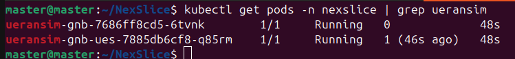
</div>

You can verify the deployment either by checking the logs of ueransim-gnb or by accessing the UE pod to view the interfaces from uesimtun0 to uesimtun99. Each should have an IP address and be able to ping:

```bash[language=bash]
sudo k3s kubectl logs -n nexslice <ueransim-gnb-pod-name>
sudo k3s kubectl exec -n nexslice <ueransim-ues-pod-name> -- ip a
sudo k3s kubectl exec -n nexslice <ueransim-ues-pod-name> -- ping -c 4 -I uesimtun0 google.com
```

<div align="center">
    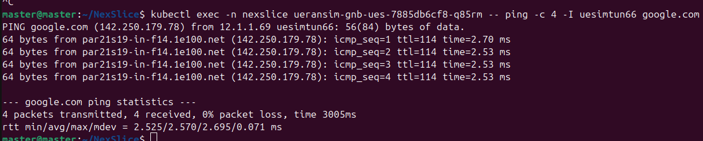
</div>

## Ping Traffic Test

Use the provided script to send ping requests from each UE:

```bash[language=bash]
chmod +x tests/ping.sh
./tests/ping.sh 
```
All UEs will attempt to ping a target (e.g., google.com) from their respective virtual interfaces.

## iPerf3 Throughput Test

1. Deploy iperf3 server using the following command : 
```bash[language=bash]
sudo k3s kubectl run iperf3 --image=maitaba/iperf3:latest
```

iperf3 pod acts as server which is listening to 100 ports from 5201 to 5301. By default, the iPerf3 server will listen to all active interfaces of the host for new connections. 


2.  Run the following script, UEs will act as clients to connect with the server (at most 100) and connect to an iperf3 server during 60 seconds.
```bash[language=bash]
chmod +x tests/iperf.sh
./tests/iperf.sh 
```

<div align="center">
    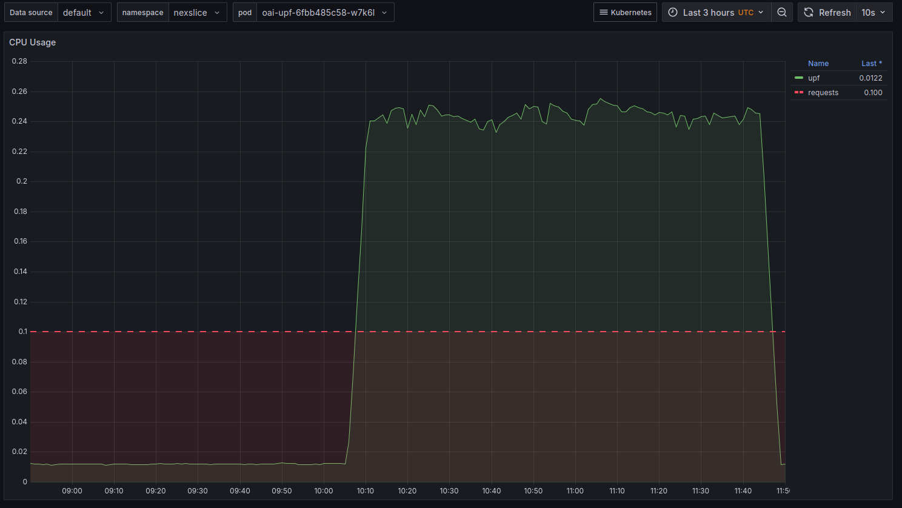
</div>

Traffic generated via iPerf3 triggers UPF autoscaling, observable through Grafana dashboards, Lens UI, and the `kubectl` CLI.
```bash[language=bash]
sudo k3s kubectl get hpa -A
```
<div align="center">
    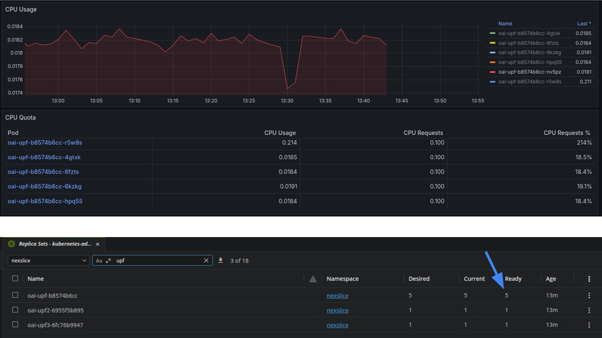
</div>

# Clean the cluster
To remove resources (pods, deployments, Helm charts, etc.), you can proceed as follows:
1. Delete Helm charts
```bash[language=bash]
helm ls -A   # List all Helm charts across namespaces
helm uninstall <chartName> -n <namespace>
```
This applies to all deployed charts such as: 5gc, cuup, cucp, du, monitoring, nrue1, nrue2, ueransim-gnb, ueransim-ue1, ueransim-ue2, ueransim-ue3

2. Delete resources applied with kubectl
```bash[language=bash]
sudo k3s kubectl delete -f <file> # Examples: metricserver.yaml, multus-cni/deployments/multus-daemonset-thick.yml
```

3. Remove a k3s agent (worker) node
```bash[language=bash]
sudo /usr/local/bin/k3s-agent-uninstall.sh
```

4. Remove the k3s server (control-plane) node
```bash[language=bash]
sudo /usr/local/bin/k3s-uninstall.sh
```

# Contact
- Yasser BRAHMI, abdenour-yasser.brahmi@telecom-sudparis.eu
